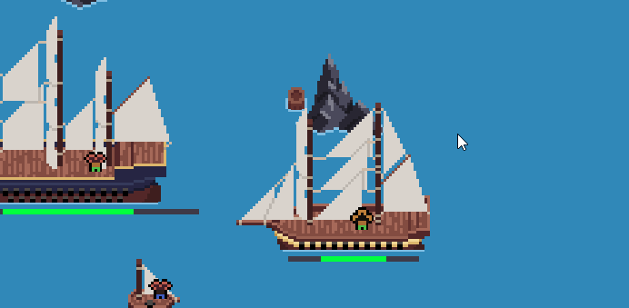
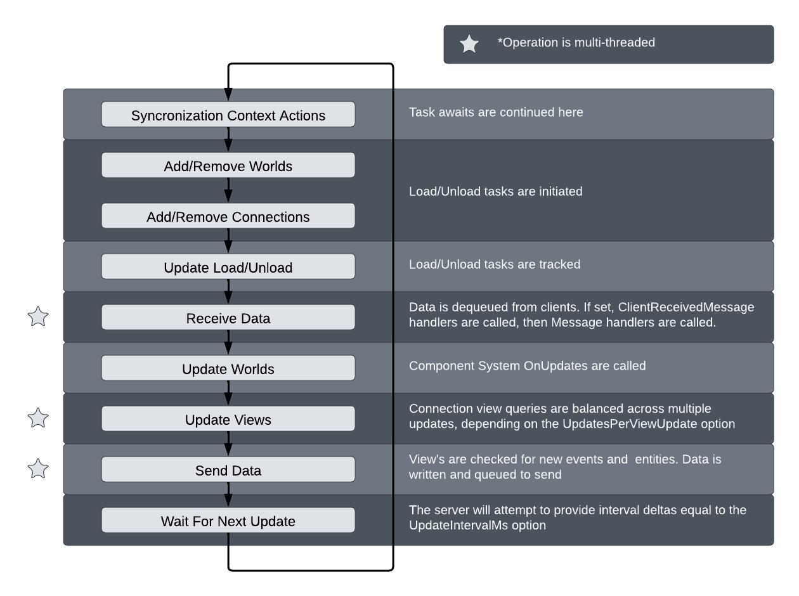

# Zero Game Development Kit



**Zero Gdk** is a C# client/server game world development framework.

# Features

- Entity-Component-System for worlds
- Client connection handling
- Entity data networking and view transmitting
- Distributed world server support
- Multithreaded operations for complete CPU usage
- Client received simulation support (simulate a client's data on the server)

# Install

## Nuget

You can install Gdk packages via nuget. There are four packages available.

- `ZeroServices.Game.Shared` - Client/Server shared code
- `ZeroServices.Game.Server` - Server integrations
- `ZeroServices.Game.Client` - Client integrations
- `ZeroServices.Game.Local` - Setting up a locally hosted server
- `ZeroServices.Game.Model` - Http classes for communicating with the local or Zero hosted server

## Unity Client

There is a Unity package available that install the gdk libraries with some Unity setup classes

To install, add a package via git url
```
https://github.com/Unnamed-Studios-LLC/Zero.Unity.git
```

# Getting started

## Plugin classes

Server and client integration are centered around the **ServerPlugin** and **ClientPlugin** classes.
Override these classes to add your implementation.

[ServerPlugin](/Zero.Game.Server/ServerPlugin.cs) `/Zero.Game.Server/ServerPlugin.cs`

[ClientPlugin](/Zero.Game.Client/ClientPlugin.cs) `/Zero.Game.Client/ClientPlugin.cs`

## Quick start guide

### Running a local game server

1. Create a new console application project
2. Install `ZeroServices.Game.Local` package
3. Create a subclass of ServerPlugin
4. Call ZeroServer.Run, passing your plugin type as the generic parameter

```csharp
class Program
{
    static async Task Main(string[] args)
    {
        await ZeroLocal.RunAsync<MockPlugin>(args);
    }
}
```

5. Next steps
    - [Adding your first world](#adding-your-first-world)
    
That's it! Your server is up and running on localhost

### Connecting a client

*Client-side*

1. Install `ZeroServices.Game.Client` package (https://github.com/Unnamed-Studios-LLC/Zero.Unity.git if using unity)
2. Create a subclass of ClientPlugin
3. Create an implementation of ILoggingProvider

*Server-side*

4. Create a program that acts as an intermediary between your clients and the game server
    - This can be any program, a REST api made with ASP.NET is a great option
    - For security reasons, an intermediary should be used, direct calls to the game world from clients is not recommended
5. Install **ZeroServices.Game.Model** package
6. Create a singleton instance of `ZeroGameClient` (cache and re-use, base url for local is `https://localhost:4001`)
7. When a client request is received, call `ZeroGameClient.ConnectionStartAsync`
8. Handle response and return ip, port, and key to client upon success

*Client-side*

9. Use ip, port, and key received from the intermediary program to call ZeroClient.Create, passing in the response information, [message handler](#message-handler), logging, and client plugin implementation.

```csharp
ZeroClient Create(IPAddress address, int port, string key, IMessageHandler messageHandler, ILoggingProvider loggingProvider, ClientPlugin plugin);
```

10. Stored the returned **ZeroClient** instance and call **Update** every network update
    - Network update is typically less than your frame/client update. Typically synced with your servers update rate.
    - For Unity, you can use FixedUpdate for this
11. Using the supplied message handler, process world, entity, and data message
    - [How Message Handlers Work](#how-message-handlers-work)

# Architecture and Overview

## Entities

A collection of related components and data. Entities do not have any object representation,
instead entities are acted on by methods using a passed in **entity id**.

## Components

An "information chunk". Typically houses data that is closely related or used by a given system.

## Systems

The logic and processes for components and entities. Systems update the game state and alter entity structure.

## Data

Data is information about an entity that is transmitted to connections. Data can be attached to an entity as **persistent** or sent
in a fire and forget **event**.

## World

A container for entities, systems, components, data, and connections.

*An entity id is created for each world.
You may use the entity id as usual, however, the GDK will handle create/destroy for the id*

## Connection

A connected client and its information.

*An entity id is created for each connection.
You may use the entity id as usual, however, the GDK will handle create/destroy for the id*

## View

A list of entity ids that a connection will receive data about.

## Message Handler

Processes received data, required for both the client and server.

# Adding your first world

# Adding your first system, entity, and component

## Component

## Entity

## System

# Writing a view query

# How message handlers work

# Misc

## Update loop and order of operations

